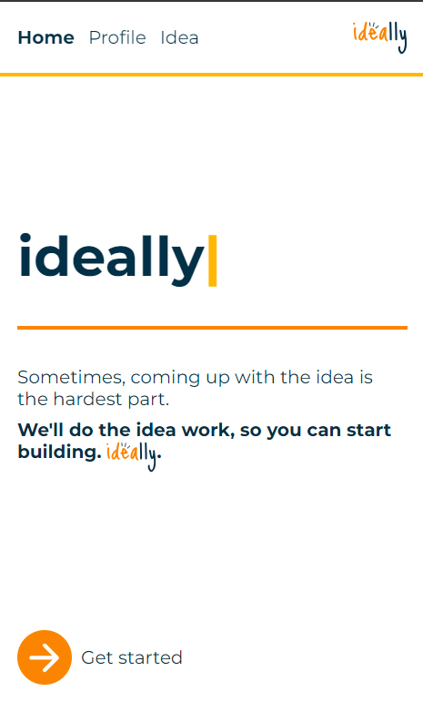
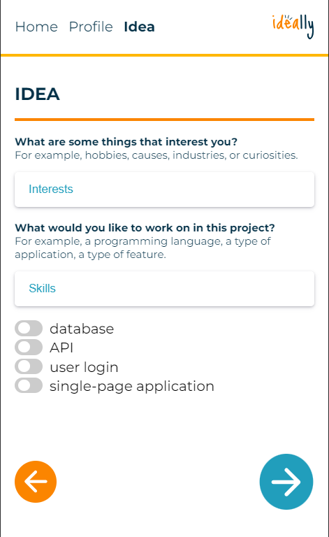
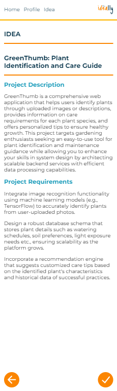
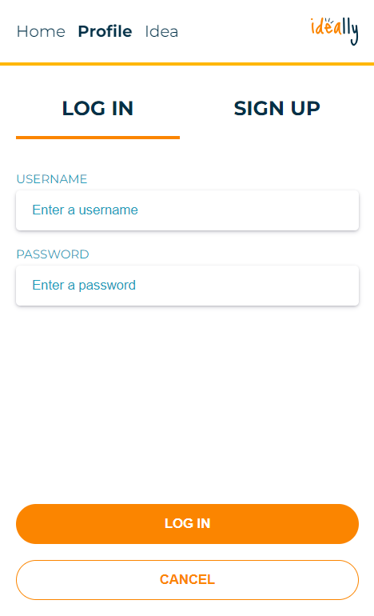
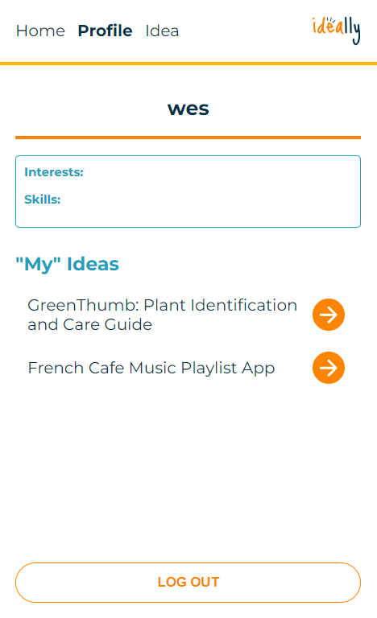

# ideally

## Overview

"ideally" is an idea generator to inspire software engineering projects, providing random or custom project ideas and a starter pack including a project descriptions, and project requirements.

### Problem

Software engineers who seek to learn a new language or improve their programming skills often do side projects, and student developers need to come up with projects that implement the skills they have learned in the course. This app will generate ideas based on the intersection of the users' interests and the programming skill they want to implement, and provide the basics so that they can start building.

### User Profile

Software developers:

-    looking to upskill, needing to apply their knowledge
-    looking to create side projects
-    who need a spark to inspire their own creativity

### Features

**Generate idea:** Take user inputs of interests and skills to generate a custom idea with a title, description, and requirements. If the user provides no input, generates a random idea.

**User login:** User login to access further features

**Save idea:** Logged in user saves desirable ideas to their profile

**View idea:** Logged in user can click on one of their saved ideas to view details

## Implementation

### Tech Stack

-    React
-    Sass
-    Typescript
-    Client libraries:
     -    react
     -    react-router-dom
     -    axios
     -    typewriter
-    Server libraries:
     -    knex
     -    express
     -    jsonwebtoken

### APIs

Connects to ideally-API:

-    For user database
-    To generate a random software engineering project brief

### Sitemap

**HOMEPAGE**
A visually bold landing page to capture the users' attention, with one-click navigation to the ideas page. Can navigate to User Login or Idea Page.

**IDEA PAGE**

User enters information on their interests and skill to apply to the project, and clicks to generate a custom idea. They can save idea if they are logged in.

**IDEA DETAILS PAGE**

Displays idea details, navigated to automatically after idea is generated. User can save idea to profile from this page.

Includes: Project title, project description, project requirements.

**USER LOGIN**

Form to sign up or log in.

"Log In" takes user to their saved ideas.

**PROFILE PAGE**

Accessed via Nav, this component lists the user's saved ideas.

## Visuals

## Roadmap

_Sprint 1: Set foundation_

-    Create & finesse chatGPT prompt
-    Connect OpenAI API
-    Connect
-    Create basic react app
-    Create a database to hold user info & preferences
-    Create API to access user idea database

_Sprint 2: Test API & database_

     - Test prompt generation with React app

_Feature: Idea Page_

     - GET request to chatGPT

_Feature: User sign up_

-    POST request for new user
-    Create sign up page & form

_Feature: User log in_

-    POST request with user information
-    Implement auth with JWT token
-    Test edge cases
-    Create log in page & form

_Feature: Save idea_

-    POST request to server
-    Create "My Ideas" page

## Nice-to-haves

**Future features:**

**Generate mockup:** Use current idea to generate a desktop mockup, eliminating visual design paralysis

**Edit idea:** Logged in user can edit saved ideas

**Add idea:** Logged in user can add their own idea to the list

As a logged in user, I want to be able to generate a basic Readme file for my project

As a logged in user, I want to be able to generate seed data for my project, defining the tables
that I want to create

As a logged in user, I want to check off my project ideas when I've done them

As a logged in user, I want to be able to upload screenshots of completed projects
